<h2>TensorFlow-FlexUNet-Image-Segmentation-Thyroid-Nodule-Ultrasound (2026/08/25)</h2>

This is the first experiment of Image Segmentation for <b>Thyroid Nodule Ultrasound </b>
 based on
our <a href="https://github.com/sarah-antillia/TensorFlow-FlexUNet-Image-Segmentation-Model">TensorFlowFlexUNet Model</a>
 (<b>TensorFlow Flexible UNet Image Segmentation Model for Multiclass</b>) and a 512x512 pixels upscaled 
 <a href="https://drive.google.com/file/d/199GULQd2bq-0Qm0j8UtE-DkEPkslC9yN/view?usp=sharing">
Thyroid-Nodule-ImageMask-Dataset.zip</a> (<a href="https://opensource.org/license/mit">MIT</a>) which was derived by us from 
  
<b>tn3k</b> subset of 
<a href="https://drive.google.com/file/d/1reHyY5eTZ5uePXMVMzFOq5j3eFOSp50F/view?usp=sharing">
<b>Thyroid Dataset</b>
</a>.
  

<b>Actual Image Segmentation for Thyroid Nodule Ultrasound Images of 512x512 pixels</b> 
As shown below, the inferred masks predicted by our segmentation are somewhat similar to the ground truth masks,
 but differ in the details. 
 
<table>
<tr>
<th>Input: image</th>
<th>Mask (ground_truth)</th>
<th>Prediction: inferred_mask</th>
</tr>
<tr>
<td>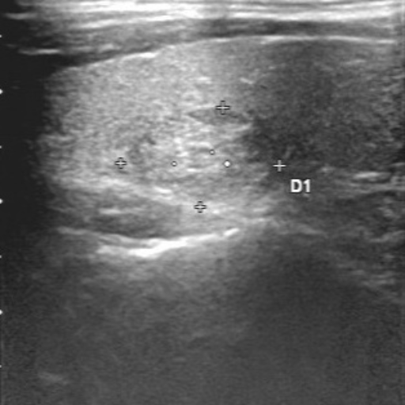</td>
<td>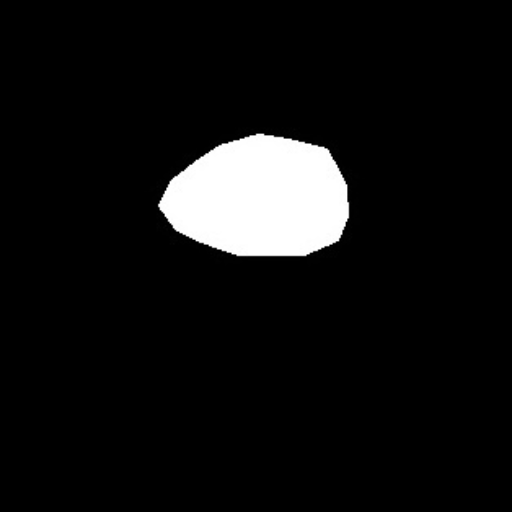</td>
<td>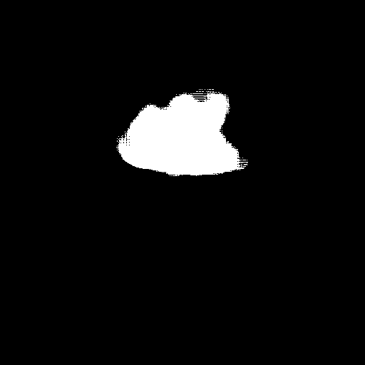</td>
</tr>
<tr>
<td>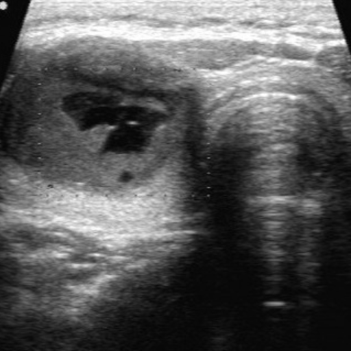</td>
<td>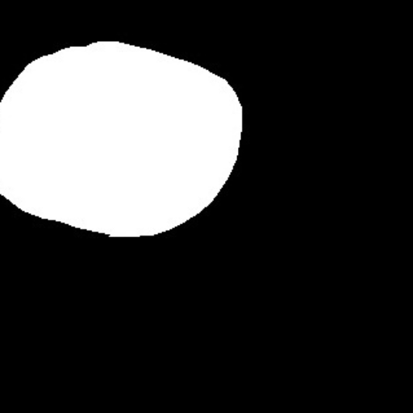</td>
<td>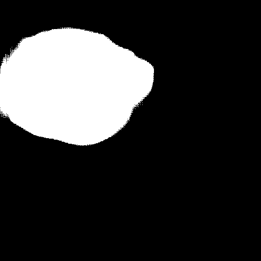</td>
</tr>
<tr>
<td>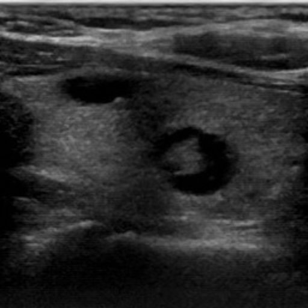</td>
<td>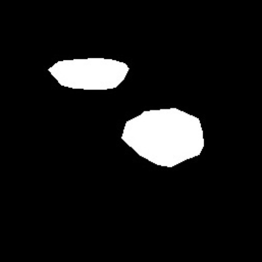</td>
<td>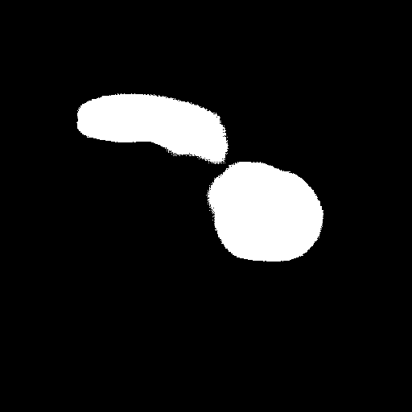</td>
</tr>
</table>

 
<h3>1. Dataset Citation</h3>
The dataset used here was derived from   
<b>tn3k/trainval</b> subset of 
<a href="https://drive.google.com/file/d/1reHyY5eTZ5uePXMVMzFOq5j3eFOSp50F/view?usp=sharing">
<b>Thyroid Dataset</b>
</a>.
  
The following explanation was taken from a Github repository 
<a href="https://github.com/haifangong/TRFE-Net-for-thyroid-nodule-segmentation">
TRFE-Plus: Thyroid Region Prior Guided Attention for Ultrasound Segmentation of Thyroid Nodules
</a>
  
<b>Introduction</b> 
Ultrasound segmentation of thyroid nodules is a challenging task, which plays an vital role in the 
diagnosis of thyroid cancer. 
However, the following two factors limit the development of automatic thyroid nodule segmentation algorithms: 
  
(1) existing automatic nodule segmentation algorithms that directly apply semantic segmentation 
techniques can easily mistake non-thyroid areas as nodules, because of the lack of the thyroid gland 
region perception, the large number of similar areas in the ultrasonic images, and the inherently low contrast images;
  
(2) the currently available dataset (i.e., DDTI) is small and collected from a single center, which violates 
 the fact that thyroid ultrasound images are acquired from various devices in real-world situations. 
 To overcome the lack of thyroid gland region prior knowledge, we design a thyroid region prior 
 guided feature enhancement network (TRFE+) for accurate thyroid nodule segmentation. Specifically, 
 (1) a novel multi-task learning framework that simultaneously learns the nodule size, gland position, 
 and the nodule position is designed; 
 (2) an adaptive gland region feature enhancement module is proposed to make full use of the thyroid 
 gland prior knowledge; 
   
 (3) a normalization approach with respect to the channel dimension is applied 
 to alleviate the domain gap during the training process.   
 To facilitate the development of 
 thyroid nodule segmentation, we have contributed <b>TN3K</b>: 
 an open-access dataset containing 3493 thyroid nodule images with high-quality nodule masks 
 labeling from various devices and views.
 We perform a thorough evaluation based on the TN3K test set and DDTI to demonstrate the 
 effectiveness of the proposed method.
  
<b>Citing</b> 
<pre>
@inproceedings{gong2021multi-task,  
  author={Gong, Haifan and Chen, Guanqi and Wang, Ranran and Xie, Xiang and Mao, Mingzhi and Yu, Yizhou and Chen, Fei and Li, Guanbin},  
  booktitle={2021 IEEE 18th International Symposium on Biomedical Imaging (ISBI)},   
  title={Multi-Task Learning For Thyroid Nodule Segmentation With Thyroid Region Prior},   
  year={2021}, 
  pages={257-261},  
  doi={10.1109/ISBI48211.2021.9434087}
}

@article{gong2022thyroid,
  title={Thyroid Region Prior Guided Attention for Ultrasound Segmentation of Thyroid Nodules},
  author={Gong, Haifan and Chen, Jiaxin and Chen, Guanqi and Li, Haofeng and Chen, Fei and Li, Guanbin},
  journal={Computers in Biology and Medicine},
  volume={106389},
  pages={1--12},
  year={2022},
  publisher={Elsevier}
}
</pre>
The label for this dataset could refer to the following article, where 0 denotes for benign while 1 denotes for malignant.
<pre>
@inproceedings{gong2022less,
  title={Less is More: Adaptive Curriculum Learning for Thyroid Nodule Diagnosis},
  author={Gong, Haifan and Cheng, Hui and Xie, Yifan and Tan, Shuangyi and Chen, Guanqi and Chen, Fei and Li, Guanbin},
  booktitle={International Conference on Medical Image Computing and Computer-Assisted Intervention},
  pages={248--257},
  year={2022},
  organization={Springer}
}
</pre>
 
<b>License</b> 
<a href="https://opensource.org/license/mit">MIT</a>
 
<h3>
2 Thyroid Nodule Ultrasound ImageMask Dataset
</h3>
<h3>2.1 Download ImageMask Dataset</h3>
 If you would like to train this Thyroid-Nodule-Images Segmentation model yourself,
 please download the dataset from Google Drive  
 <a href="https://drive.google.com/file/d/199GULQd2bq-0Qm0j8UtE-DkEPkslC9yN/view?usp=sharing">Thyroid-Nodule-ImageMask-Dataset.zip</a>
 (<a href="https://opensource.org/license/mit">MIT</a>) , 
expand the downloaded ImageMaskDataset and put it under <b>./dataset</b> folder to be
 
<pre>
./dataset
└─Thyroid-Nodule
    ├─test
    │   ├─images
    │   └─masks
    ├─train
    │   ├─images
    │   └─masks
    └─valid
         ├─images
         └─masks
</pre>
 
<b>Thyroid-Nodule Statistics</b> 
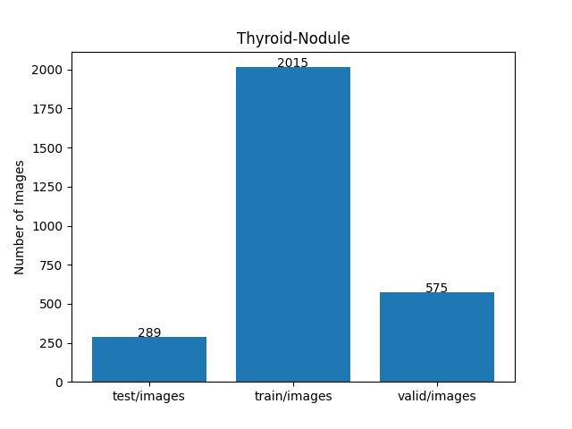 
 
As shown above, the number of images of train and valid datasets is large enough to use for the
 training set of our segmentation model.
  
<h3>2.2 Train Sample Images and Masks</h3>
<b>Train_sample_images</b> 
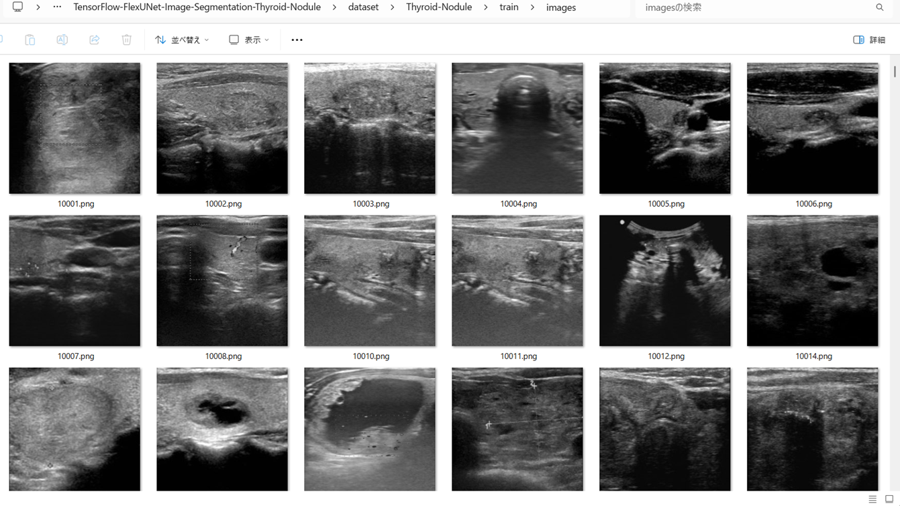
 
<b>Train_sample_masks</b> 
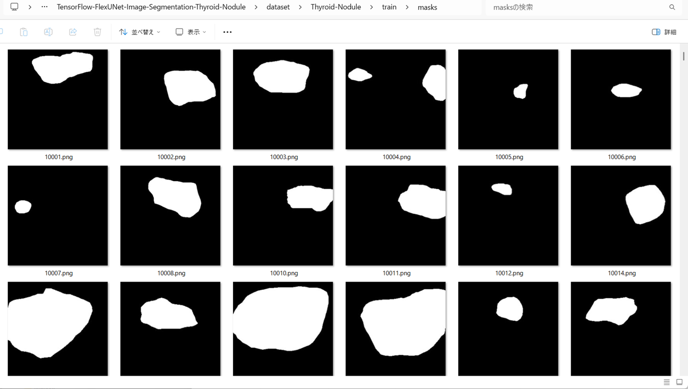
 
<h3>
3 Train TensorFlowFlexUNet Model
</h3>
 We trained Thyroid-Nodule-Images TensorFlowFlexUNet Model by using the following
<a href="./projects/TensorFlowFlexUNet/Thyroid-Nodule/train_eval_infer.config"> <b>train_eval_infer.config</b></a> file.  
Please move to <b>./projects/TensorFlowFlexUNet/Thyroid-Nodule</b> folder and run the following bat file. 
<pre>
>1.train.bat
</pre>
This simply runs the following command. 
<pre>
>python ../../../src/TensorFlowFlexUNetTrainer.py ./train_eval_infer.config
</pre>

<b>Model parameters</b> 
Defined a small <b>base_filters=16 </b> and large <b>base_kernels=(11,11)</b> for the first Conv Layer of Encoder Block of 
<a href="./src/TensorFlowFlexUNet.py">TensorFlowFlexUNet.py</a> 
and a large <b>num_layers=8</b> (including a bridge between Encoder and Decoder Blocks).
<pre>
[model]
;You may specify your own UNet class derived from our TensorFlowFlexModel
model         = "TensorFlowFlexUNet"
generator     =  False
image_width    = 512
image_height   = 512
image_channels = 3
input_normalize = True
normalization  = False
num_classes    = 2
base_filters   = 16
base_kernels   = (11,11)
num_layers     = 8
dropout_rate   = 0.04
dilation       = (3,3)
</pre>
<b>Learning rate</b> 
Defined a small learning rate.  
<pre>
[model]
learning_rate  = 0.00007
</pre>
<b>Loss and metrics functions</b> 
Specified "categorical_crossentropy" and <a href="./src/dice_coef_multiclass.py">"dice_coef_multiclass"</a>. 
<pre>
[model]
loss           = "categorical_crossentropy"
metrics        = ["dice_coef_multiclass"]
</pre>
<b>Dataset class</b> 
Specifed <a href="./src/ImageCategorizedMaskDataset.py">ImageCategorizedMaskDataset</a> class. 
<pre>
[dataset]
class_name    = "ImageCategorizedMaskDataset"
</pre>
 
<b>Learning rate reducer callback</b> 
Enabled learing_rate_reducer callback, and a small reducer_patience.
<pre> 
[train]
learning_rate_reducer = True
reducer_factor     = 0.5
reducer_patience   = 4
</pre>
<b>Early stopping callback</b> 
Enabled early stopping callback with the patience parameter.
<pre>
[train]
patience      = 10
</pre>
<b>RGB Color map</b> 
Specified rgb color map dict for Thyroid-Nodule 2 classes. 
<pre>
[mask]
mask_datatype= "categorized"
mask_file_format = ".png"
;Thyroid-Nodule rgb color map dict for 1+1 classes.
;        background:black, Thyroid-Nodule
rgb_map = {(0,0,0):0,(255,255,255):1}
</pre>

<b>Epoch change inference callback</b> 
Enabled <a href="./src/EpochChangeInferencer.py">epoch_change_infer callback</a></b>. 
<pre>
[train]
epoch_change_infer       = True
epoch_change_infer_dir   =  "./epoch_change_infer"
num_infer_images         = 6
</pre>

By using this callback, on every epoch_change, the inference procedure can be called
 for 6 images in the <b>mini_test</b> folder. This will help you confirm how the predicted mask changes 
 at each epoch during your training process.  
 
<b>Epoch_change_inference output at starting (epoch 1,2,3)</b> 
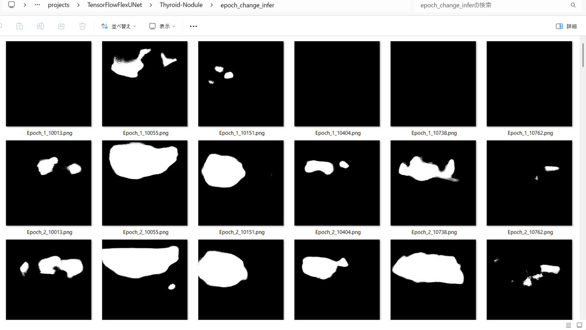 
 
<b>Epoch_change_inference output at middlepoint (epoch 14,15,16)</b> 
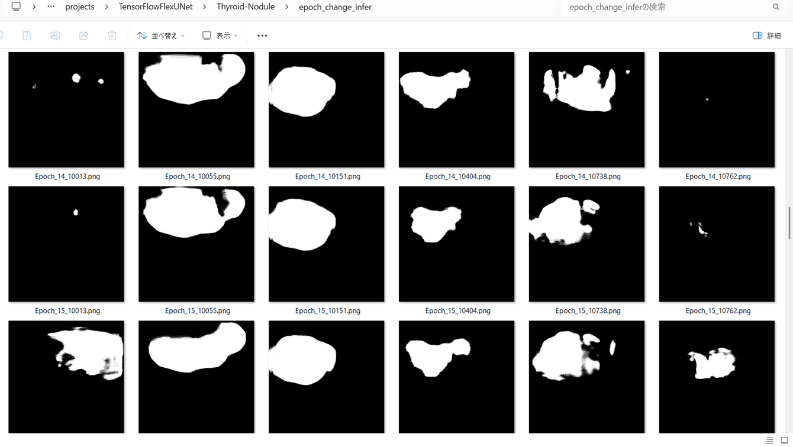 
 

<b>Epoch_change_inference output at ending (epoch 30,31,32)</b> 
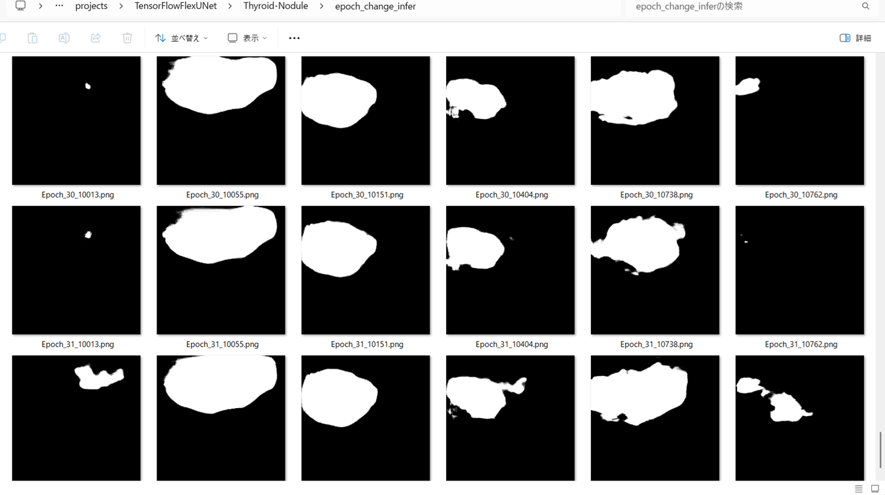 
 
In this experiment, the training process was terminated at epoch 32.  
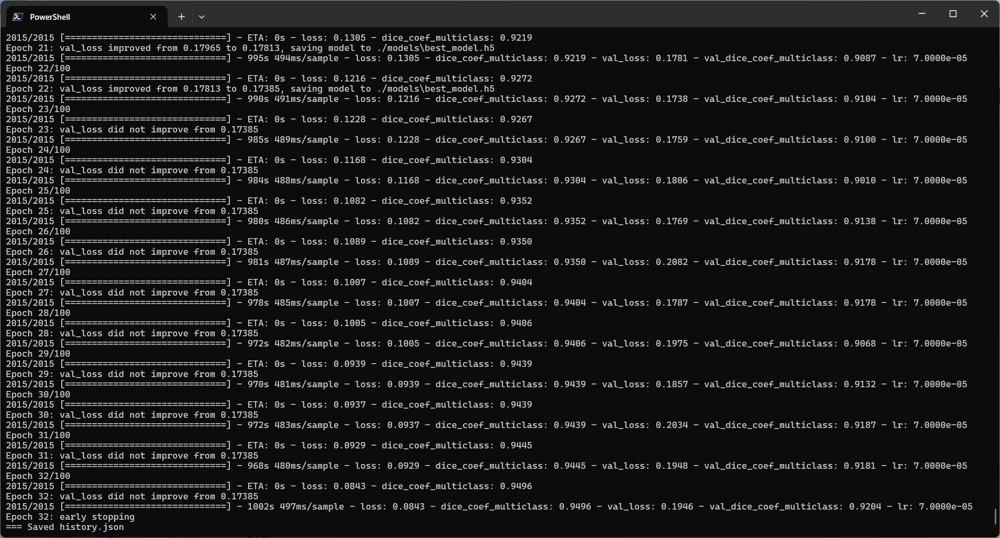 
 
<a href="./projects/TensorFlowFlexUNet/Thyroid-Nodule/eval/train_metrics.csv">train_metrics.csv</a> 
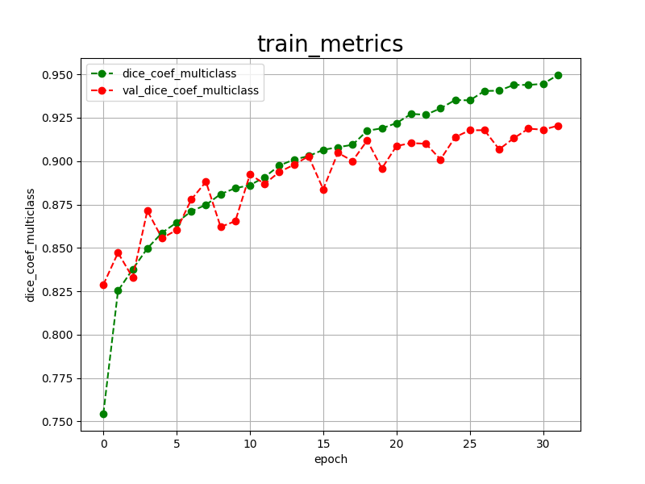 
 
<a href="./projects/TensorFlowFlexUNet/Thyroid-Nodule/eval/train_losses.csv">train_losses.csv</a> 
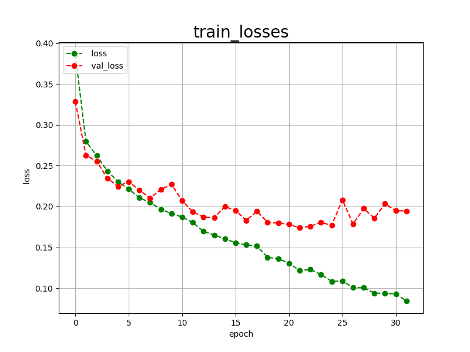 
 
<h3>
4 Evaluation
</h3>
Please move to <b>./projects/TensorFlowFlexUNet/Thyroid-Nodule</b> folder, 
and run the following bat file to evaluate the TensorFlowUNet model for Thyroid-Nodule-Images. 
<pre>
./2.evaluate.bat
</pre>
This simply runs the following command.
<pre>
python ../../../src/TensorFlowFlexUNetEvaluator.py ./train_eval_infer_aug.config
</pre>

Evaluation console output: 
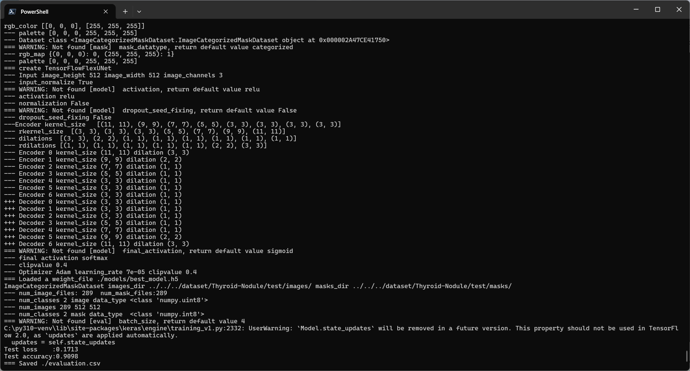
  Image-Segmentation-Thyroid-Nodule-Images

<a href="./projects/TensorFlowFlexUNet/Thyroid-Nodule/evaluation.csv">evaluation.csv</a> 
The loss (categorical_crossentropy) to this Thyroid-Nodule-Images/test was not low, and dice_coef_multiclass 
not high, as shown below.
 
<pre>
categorical_crossentropy,0.1713
dice_coef_multiclass,0.9098
</pre>
 
<h3>
5 Inference
</h3>
Please move to <b>./projects/TensorFlowFlexUNet/Thyroid-Nodule</b> folder 
,and run the following bat file to infer segmentation regions for images using the Trained-TensorFlowUNet model for Thyroid-Nodule-Images. 
<pre>
./3.infer.bat
</pre>
This simply runs the following command.
<pre>
python ../../../src/TensorFlowFlexUNetInferencer.py ./train_eval_infer_aug.config
</pre>

<b>mini_test_images</b> 
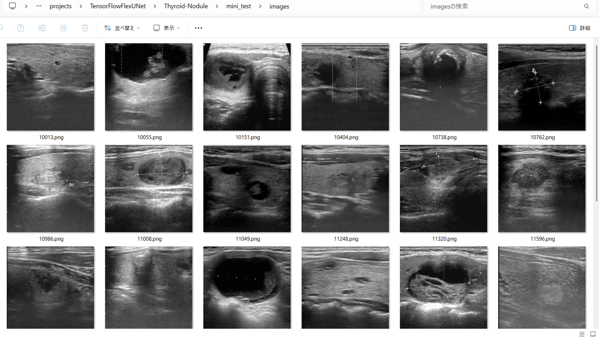 
<b>mini_test_mask(ground_truth)</b> 
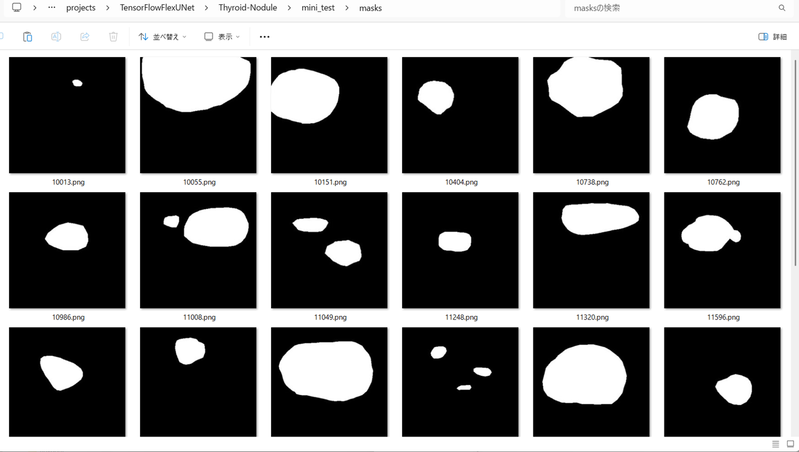 

<b>Inferred test masks</b> 
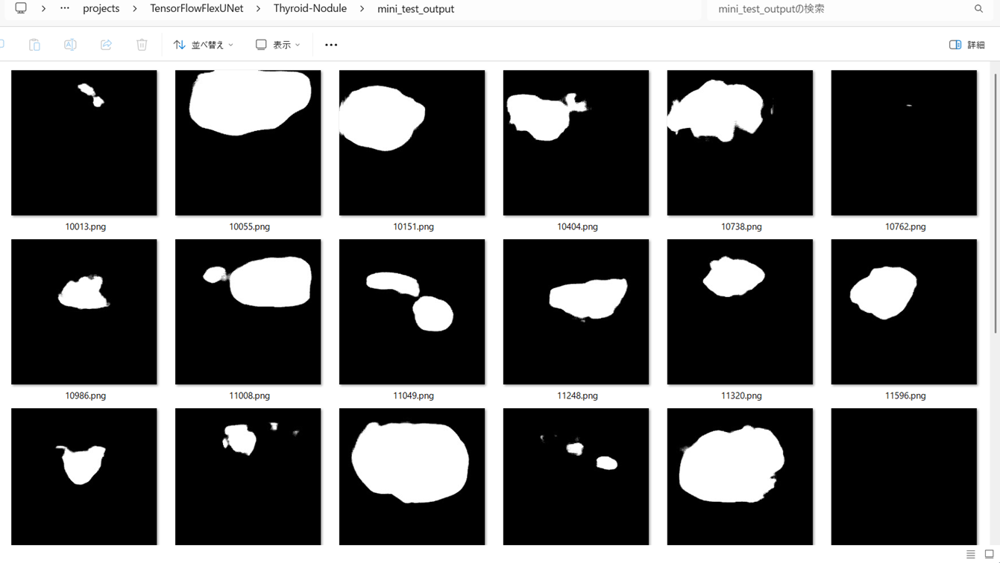 
 

<b>Enlarged images and masks for Thyroid Nodule Ultrasound Images of 512x512 pixels</b> 
As shown below, the inferred masks predicted by our segmentation are somewhat similar to the ground truth masks,
 but differ in the details.  
<table>
<tr>
<th>Image</th>
<th>Mask (ground_truth)</th>
<th>Inferred-mask</th>
</tr>
<tr>
<td>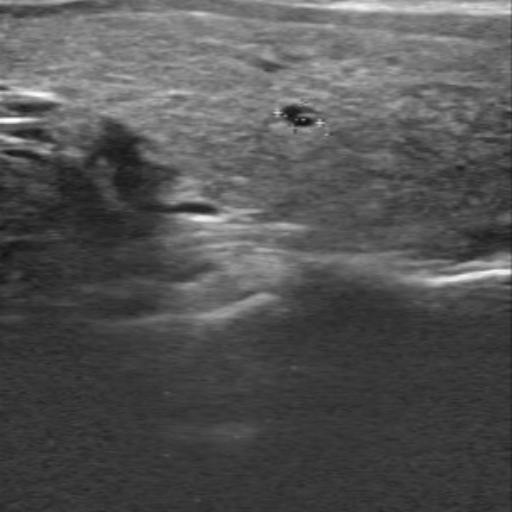</td>
<td>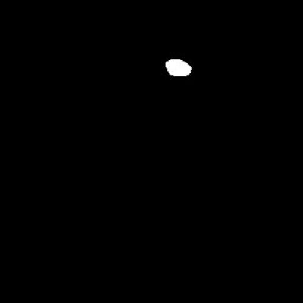</td>
<td>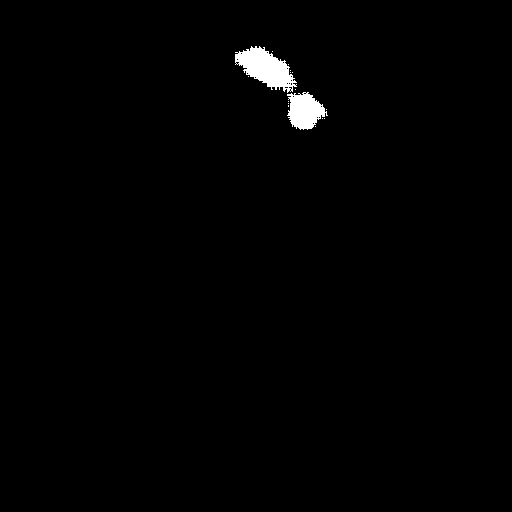</td>
</tr>

<tr>
<td></td>
<td></td>
<td></td>
</tr>

<tr>
<td></td>
<td></td>
<td></td>
</tr>

<tr>
<td>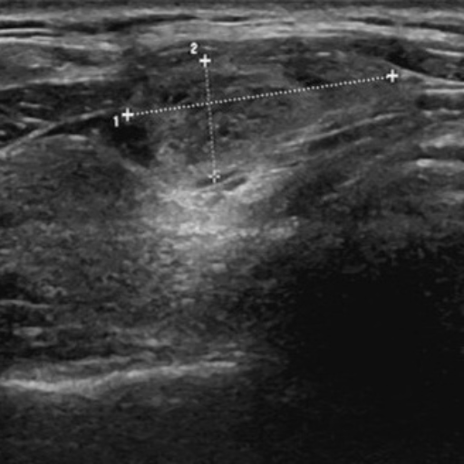</td>
<td>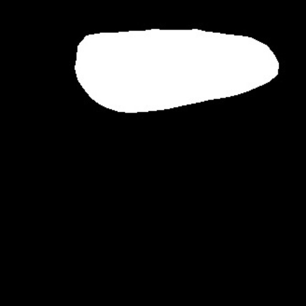</td>
<td>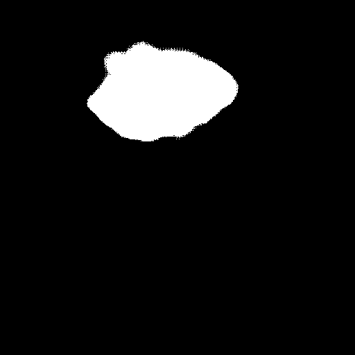</td>
</tr>

<tr>
<td>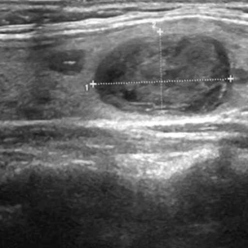</td>
<td>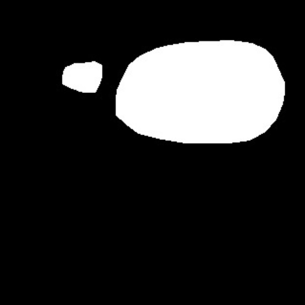</td>
<td>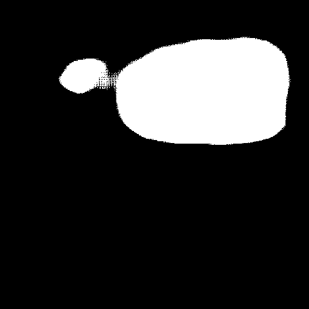</td>
</tr>

<tr>
<td>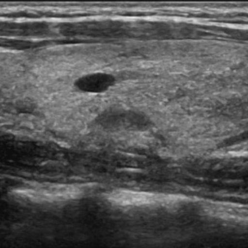</td>
<td>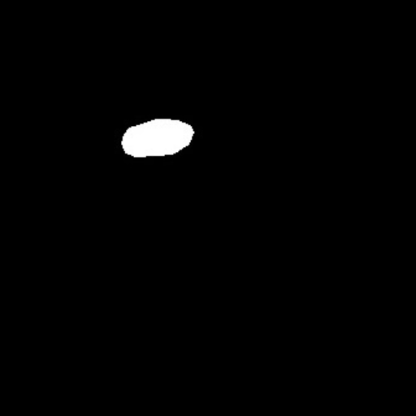</td>
<td>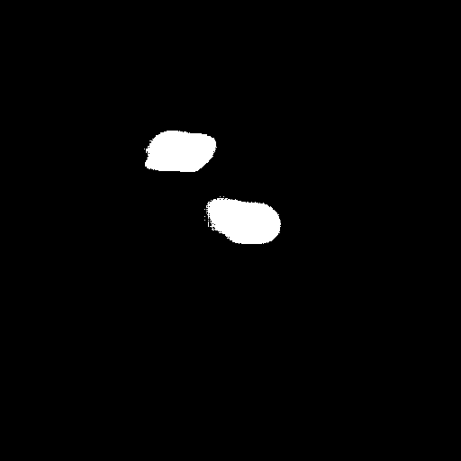</td>
</tr>
</table>

 
<h3>
References
</h3>
<b>1. TRFE-Plus: Thyroid Region Prior Guided Attention for Ultrasound Segmentation of Thyroid Nodules</b> 
Haifan Gong 
<a href="https://github.com/haifangong/TRFE-Net-for-thyroid-nodule-segmentation">
https://github.com/haifangong/TRFE-Net-for-thyroid-nodule-segmentation
</a>
 
 
<b>2. Thyroid region prior guided attention for ultrasound segmentation of thyroid nodules</b> 
Haifan Gong, Jiaxin Chen, Guanqi Chen, Haofeng Li, Guanbin Li, Fei Chen 
<a href="https://www.sciencedirect.com/science/article/abs/pii/S0010482522010976">
https://www.sciencedirect.com/science/article/abs/pii/S0010482522010976
</a>
  
<b>3. Segmentation of thyroid glands and nodules in ultrasound images using the improved U-Net architecture</b> 
Tianlei Zheng, Hang Qin, Yingying Cui, Rong Wang, Weiguo Zhao, Shijin Zhang, Shi Geng & Lei Zhao 
<a href="https://link.springer.com/article/10.1186/s12880-023-01011-8">
https://link.springer.com/article/10.1186/s12880-023-01011-8
</a>
  
<b>4. TensorFlow-FlexUNet-Image-Segmentation-Thyroid-Ultrasound </b> 
Toshiyuki Arai 
<a href="https://github.com/sarah-antillia/TensorFlow-FlexUNet-Image-Segmentation-Thyroid-Ultrasound">
https://github.com/sarah-antillia/TensorFlow-FlexUNet-Image-Segmentation-Thyroid-Ultrasound
</a>
  
<b>5. TensorFlow-FlexUNet-Image-Segmentation-Model </b> 
Toshiyuki Arai 
<a href="https://github.com/sarah-antillia/TensorFlow-FlexUNet-Image-Segmentation-Model">
https://github.com/sarah-antillia/TensorFlow-FlexUNet-Image-Segmentation-Model
</a>
